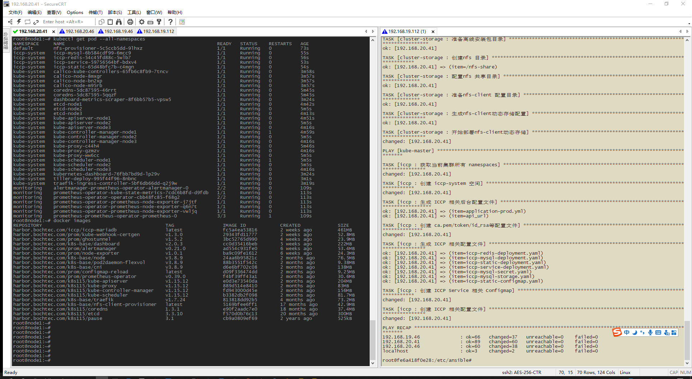

# 

```
部署方式
1、使用Dockerfile基于debian生成个镜像，网络太差，上传不到hub去
2、自行安装ansible，反正大概其都是Dockerfile里面的命令，你apt、yum了就行了，然后拷贝ansible目录到相应地方
3、install/clean你懂，理论是一键部署，我测试的结果
```

```
以下为兼容arm64/amd64的镜像，测试通过，misp64的需要去龙芯那里下载
FROM calico/kube-controllers:v3.8.9
FROM calico/pod2daemon-flexvol:v3.8.9
FROM calico/node:v3.8.9
FROM calico/cni:v3.8.9
FROM kubernetesui/dashboard:v2.0.3
FROM jessestuart/tiller:v2.16.7
FROM rancher/hyperkube:v1.14.8-rancher2
FROM carlosedp/kube-state-metrics:v1.9.6
FROM prom/node-exporter:v1.0.1
FROM rancher/hyperkube:v1.16.12-rancher1
FROM carlosedp/prometheus-config-reloader:v0.39.0
FROM carlosedp/configmap-reload:latest 
FROM carlosedp/prometheus-operator:v0.39.0
FROM jettech/kube-webhook-certgen:v1.3.0
FROM raspbernetes/ghostunnel:v1.5.2
FROM prom/alertmanager:v0.21.0
FROM prom/prometheus:v2.19.2
FROM kubesphere/kube-apiserver:v1.15.12
FROM kubesphere/kube-proxy:v1.15.12
FROM kubesphere/kube-controller-manager:v1.15.12
FROM kubesphere/kube-scheduler:v1.15.12
FROM coredns/coredns:1.3.1
FROM kontenapharos/etcd:3.3.10
FROM kubesphere/pause:3.1
```
